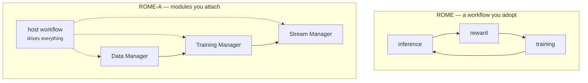
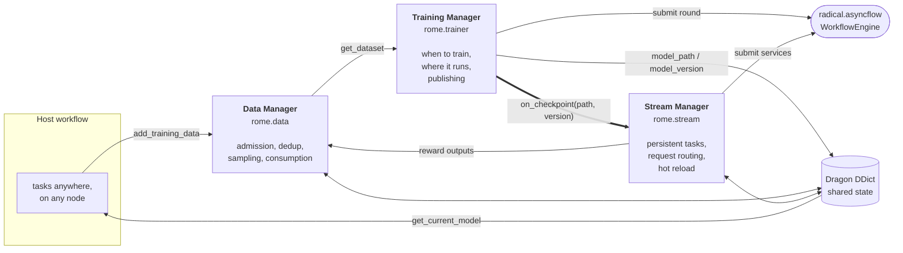

# Architecture

## The inversion

The original ROME was a workflow. It had three components — model inference,
reward/simulation, model training — and it owned the control flow between them.
Building a *new* self-improvement workflow on top of it was easy. Plugging it
into a workflow that already existed was not: you adopted ROME's control flow, or
you did not adopt ROME. For a production campaign like IMPRESS, with its own
pipeline, its own scheduler and its own operational history, that is not a trade
anyone makes.

ROME-A keeps the same three components and gives up the control flow. Each
component becomes a configurable unit that a host workflow *attaches*, and the
host keeps driving.



Three consequences follow, and they are the design's actual claims:

* **Each component is a configurable unit.** `DataConfig`, `TrainerConfig`,
  `StreamConfig` — every policy the old workflow hard-coded is a field.
* **Adding a model or training algorithm is a single task.** One `TrainTask`
  subclass with one method. Nothing above it knows what is being trained.
* **Adoption costs a few API calls.** `add_training_data`, `get_current_model`,
  `start`, `stop`.

## What each manager owns



| Manager | Owns | Does **not** own |
| --- | --- | --- |
| [Data](../guide/data.md) | What a record is, which are admitted, which are deduplicated, which make up a shard, what "fresh" means. | When training happens. Any schema — records are arbitrary keywords. |
| [Training](../guide/training.md) | Whether a round is possible, submitting it, publishing the result, the status question. | *What* training is. That is a `TrainTask`. |
| [Stream](../guide/streams.md) | The persistent task lifecycle, request routing and claiming, when weights swap. | The inference or reward code itself. The workflow supplies that. |

The boundary is consistent: **ROME-A owns the loop, the workflow owns the body.**
A `process_func` is the workflow's inference code; a `TrainTask` is the
workflow's training code; a `filter_func` is the workflow's quality judgement.
ROME-A supplies the machinery around them and nothing that would need to know
about proteins, or language models, or any particular domain.

## The line that closes the loop

`Manager.start()` contains one line that is the whole of ROME:

```python
self.trainer.on_checkpoint(self.stream.on_checkpoint)
```

The training manager's checkpoint callback *is* the stream manager's reload hook.
A completed training round is therefore the event that swaps inference onto the
new model. There is no supervisor watching for it, no polling loop in the host
workflow, no "if new checkpoint then restart inference" anywhere in the campaign
code.

Everything else about the loop is a consequence:

* Because streams are **persistent services**, there is a running process to swap
  weights *into* — inference is never restarted, and the campaign never pauses at
  a model boundary.
* Because a stream reloads **between batches**, the swap cannot interrupt an
  in-flight call.
* Because the manager writes the checkpoint **path before the version**, a stream
  that notices the new version always finds a valid path behind it.

## Ordering, and why it is what it is

`start()`:

1. bring up the streams,
2. register the checkpoint hook,
3. start the trainer.

Streams come up first so they are already draining requests by the time the first
checkpoint lands, and the hook is registered before the trainer can fire a round —
otherwise a very fast first round could publish weights nobody is listening for.

`stop()`:

1. stop the trainer, waiting out any in-flight round,
2. stop the streams, draining them,
3. release the stream group dictionaries,
4. shut down the workflow engine, *only if ROME-A built it*.

Trainer first because an in-flight round is waited out rather than cancelled —
killing a half-finished fine-tune leaves a torn checkpoint — and letting the
streams keep serving while it finishes means the final checkpoint still reaches
them. An engine the host handed over is still running the host's tasks, so it is
not ROME-A's to shut down.

## Ownership of resources

ROME-A borrows rather than owns wherever it can, and the rule is the same for
every resource: **whoever allocated it, releases it.**

| Resource | Default | Shared |
| --- | --- | --- |
| Workflow engine | Built at `start()`, shut down at `stop()`. | `Manager(asyncflow=...)` — the host's, never shut down by ROME-A. |
| Manager dictionary | Allocated with 1 GiB (Dragon's 3 MiB default is not enough for a real corpus). | `Manager(ddict=...)` — ROME-A namespaces its keys under `rome\|` so nothing collides. |
| Stream group dictionary | One per group, allocated at `start()`, destroyed at `close()`. | `StreamConfig(ddict=...)` — left alone on teardown. |

## Failure containment

Every boundary where workflow-supplied code runs is wrapped, and each wrap has a
different containment rule chosen for what is at stake:

| Boundary | On failure |
| --- | --- |
| `process_func` raises | Every request in that batch gets `{"error": ...}`; the stream keeps running. One malformed payload must not take down a task the campaign depends on. |
| `on_output` / checkpoint callback raises | Printed and swallowed. A bad hook must not lose a checkpoint or kill a stream. |
| A training round raises (auto-train) | Recorded in `last_error`, status returns to idle, polling continues — unless `stop_on_failure`. |
| A training round raises (manual `start_training`) | Propagates. A manual trigger is expected to surface its own errors. |
| `validate(dataset)` raises | Before submission, on the manager. An unusable corpus never costs an allocation. |

## Where to read next

* [Shared state](state.md) — how a record added on one node reaches a training
  task on another, and the single rule that makes it safe.
* [Execution](execution.md) — how rounds and streams reach the workflow engine,
  and what happens when the backend never delivers a result.
* [ROME-A on Dragon](../dragon.md) — what running on real Dragon turned up.
