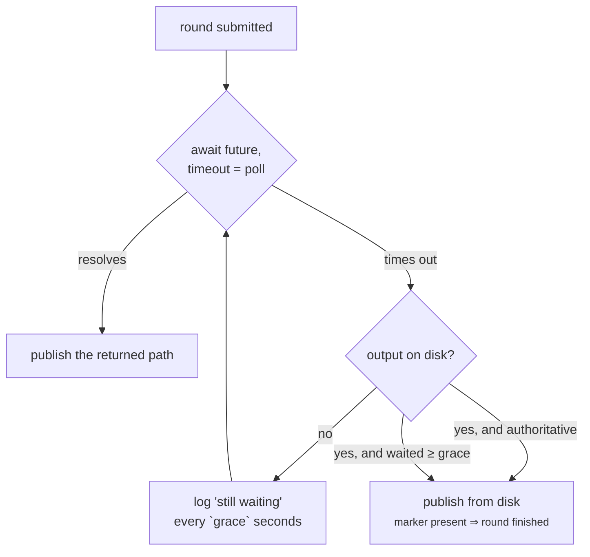

# Execution

**ROME schedules nothing itself.** Every training round and every stream task
is submitted to the `radical.asyncflow` `WorkflowEngine` the host workflow passes
in, with per-task resources given as an asyncflow `task_description`. That is not
a limitation — it is the point. ROME's tasks are placed by the same scheduler,
against the same allocation, as the campaign's own.

There is exactly one place in the codebase that talks to asyncflow:
[`rome.utils.submit_task`][rome.utils.submit_task].

## Three shapes of task

```python
submit_task(asyncflow, func, task_description=..., service=..., executable=...)
```

| Shape | Used for | Body returns |
| --- | --- | --- |
| **Function task** | A training round, by default. | The trainer's checkpoint path. |
| **Function task, `service=True`** | Every inference and reward stream. | Never returns — it runs for the campaign. |
| **Executable task** | A training round whose `TrainTask` implements `as_command()`. | The **shell command line to run**, not a Python result. |

asyncflow only accepts `async def` bodies. For a function task, a blocking
trainer or inference call belongs inside an `asyncio.to_thread` — which is what
ROME does, so a synchronous `TrainTask.train` is exactly the right thing to
write. For an executable task the body instead returns the command string, the
same shape IMPRESS uses for its wrapper scripts.

## Resources

`TrainTask.gpus`/`nodes` and `StreamConfig.num_gpus`/`num_nodes` are ROME's
coarse resource fields.
[`resource_description`][rome.utils.resource_description] turns them into the two
keys the RADICAL backends share:

```python
{"ranks": nodes, "gpus_per_rank": gpus}
```

The concrete keys an execution backend understands are its own business, so that
is *all* ROME fills in. Anything you pass explicitly wins:

```python
rome.TrainerConfig(task_description={"ranks": 2, "gpus_per_rank": 4,
                                     "pre_exec": ["module load cuda"]})
rome.StreamConfig(task_description={...})
```

A `task_description` is passed straight through and never interpreted. Workflows
on an exotic backend should set it explicitly and ignore `gpus`/`nodes`.

## Pickling: what crosses the process boundary

A Dragon execution backend runs a task body in a **different process**, so
everything the body closes over has to survive pickling. Two design decisions
follow, and both were bought with real debugging time.

### Stream bodies capture a `StreamTask` and nothing else

```python
async def stream_entry(_task=task):
    await run_stream_task(_task)
```

`run_stream_task` is a **module-level function taking only a `StreamTask`**. A
`StreamTask` pickles: its DDict views and its Dragon events are transportable,
and Dragon re-attaches the receiving process automatically.

A bound method would drag the `Stream` manager along, and therefore the workflow
engine, which does not pickle — **and the symptom is a task that never starts
rather than an error.** Same reason `_command_body` is defined at module scope
and closes over only the command string.

### `task_fut` is dropped on the way out

```python
_DRIVER_ONLY = ("task_fut",)

def __getstate__(self):
    state = dict(self.__dict__)
    for name in self._DRIVER_ONLY:
        state[name] = None
    return state
```

This one is worth understanding, because its failure mode is catastrophic and
silent. The task body closes over the `StreamTask` **by reference**, and a
multi-process backend pickles that body from its dispatcher thread *after*
`Stream.start()` has assigned the submission future to `task.task_fut`. An
`_asyncio.Future` cannot be pickled, so the dispatcher raises, dies, and **every
task queued behind it — ROME's or the host workflow's — silently never runs.**

Dropping the future in `__getstate__` makes the body picklable whenever the
backend gets round to it.

## Services hold execution slots

A stream is submitted with `service=True` and never returns. It therefore
occupies one of the allocation's concurrent-task slots for the whole campaign.

!!! warning "Leave room for the training round"

    `num_streams` replicas permanently occupy `num_streams` slots. If that is the
    allocation's entire capacity, a training round is accepted and **never
    placed** — and what you observe is a round that stays pending forever, with
    no error anywhere.

    On a small node the concurrent-task capacity is ~2. Measure yours:

    ```bash
    dragon -s tests/dragon/test_task_capacity_dragon.py
    ```

This is also why `examples/agnostic/dummy_loop.py` drops to one replica on the
Dragon backend while using two on the local one.

## When the backend never delivers a result

This is the sharpest edge in ROME's execution story, and it is a real backend
defect rather than a convenience.

**What happens.** Dragon pre-registers a running task's result key, so *reading*
that key blocks rather than raising `KeyError`. rhapsody's monitor sweeps its
outstanding tasks in order, so a task that never completes — which is exactly what
a ROME inference stream is — blocks the sweep on its own key forever. Every
result behind it, **including a finished training round**, is never delivered.

Confirmed by direct measurement:

```text
manager(0)['0-0'] -> STILL BLOCKED after 20s   # the stream service
manager(0)['0-1'] -> returned in 0.12s         # the finished round
```

**Why it is survivable.** The round itself is fine. It ran, and its checkpoint is
on disk. Only the notification is lost — so the checkpoint is the sounder signal.

### The fallback

[`Trainer._await_round`][rome.trainer.Trainer] waits for a round to finish as
soon as *either* its future resolves *or* its output appears on disk:



Awaiting the future is what actually *drives* the task, so the wait is a
`asyncio.wait_for` over an `asyncio.shield` — the timeout must not cancel the
round.

`result_fallback_seconds` (default 60 s) is the grace period. Set it to `None` to
disable the fallback and wait on the backend forever.

A round that never resolves and never writes output logs a `still waiting` line
every grace period rather than looping silently — a silent re-wait is exactly what
a hang looks like. That is normal while a round is running; it means trouble only
if the output stays absent long past when the round should have finished, which
points at the round not being scheduled at all (see [services hold slots](#services-hold-execution-slots)).

### The `train_complete` marker

For an **executable** round, the disk signal is a dedicated marker file, not the
checkpoint:

```python
TRAIN_COMPLETE_MARKER = "train_complete"
```

The checkpoint cannot be the signal, because with `publish_into_repo` it is a
stable path that already exists from the previous round — or from the initial
weights. Its presence proves nothing.

The wrapper writes the marker into `output_dir` as its **final** action, after the
checkpoint is safely on disk. So the marker appearing *is* completion, which is
why the executable path is polled briskly (every 2 s) and published the instant
it appears, rather than waiting out the full grace period.

For a **function** round the future's return value is the real checkpoint path, so
ROME gives the backend the full grace to deliver it before falling back to the
output directory. A failed round still surfaces its exception, because a body that
raised never writes its output.

Any trainer implementing `as_command()` must honour that contract — see
[Writing a trainer](../guide/trainers.md#running-a-round-as-a-command).

## Why a GPU round should be a command

An in-process training round leaves the model's CUDA context resident in the
driver process for the **whole campaign** — the round ends, the VRAM does not come
back. An executable round is a subprocess that exits when the round ends, taking
its VRAM with it.

That is why `ProteinMPNNTrainer` submits a command rather than pickling `train`
into a worker, and why `Manager` warns when neither `asyncflow` nor `backend` is
given: asyncflow then falls back to a local, in-process backend, which is fine for
tests and CPU work and wrong for a fine-tune.

For a process-based backend without Dragon:

```python
from concurrent.futures import ProcessPoolExecutor
backend = await ConcurrentExecutionBackend(ProcessPoolExecutor())
```

See `examples/impress_r/run_protein_binding_rome.py` for the real-campaign
version, and [Setting up on Delta](../delta.md) for the Dragon one.
