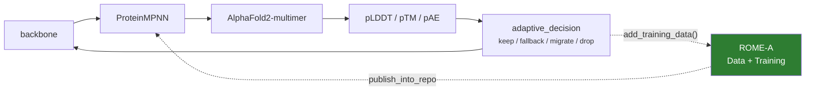

# IMPRESS-R

IMPRESS runs backbone → ProteinMPNN → structure prediction → pLDDT/pTM/pAE →
keep/fallback/migrate/drop. It is **open loop**: each campaign improves the
designs, never the model. Every campaign starts from the same public ProteinMPNN
weights, no matter how much the previous one learned.

**IMPRESS-R** adds ROME-A so the campaign's own highest-confidence sequences
fine-tune ProteinMPNN mid-campaign, and the improved model returns to the
pipeline. **IMPRESS itself runs unchanged.**



Four examples, in order of how much of the real campaign they involve. The
background — installing IMPRESS from the `archive/ipdps_pdz_usecase` branch, the
one incompatibility, what was verified — is in
[Running IMPRESS](../impress.md). The trainer itself is in
[Fine-tuning ProteinMPNN](../proteinmpnn_training.md).

## The smallest integration

`examples/impress_r/dummy_adaptive_rome.py` — **start here.**

IMPRESS's own `examples/dummy_adaptive.py` — the minimal adaptive pipeline,
`sequence_analysis → fitness_evaluation → [adaptive step] → optimization_step`,
with random child-pipeline spawning — with **two lines of ROME-A** added inside
the adaptive function:

```python
manager.add_training_data(...)     # this generation's designs
manager.get_current_model()        # the improved model, if any
```

Nothing else changes. ROME-A's training manager watches the corpus those
contributions build and, once `min_samples` designs have arrived, runs a round on
its own — here the `DummyTrainer`. The next generation to call
`get_current_model` picks it up. **The pipeline code never schedules training and
never blocks on it.**

To make the loop visible with no real model in it, `fitness_evaluation` produces
better designs as the published model version climbs, so a child generation
running a freshly trained checkpoint scores higher than its parent.

```bash
dragon -s examples/impress_r/dummy_adaptive_rome.py
```

## The four calls against a stand-in pipeline

`examples/agnostic/impress_r.py`

The same shape without needing IMPRESS installed: `run_impress_cycle` stands in
for the pipeline and runs unchanged, and ROME-A is four calls — build a manager,
contribute, collect, stop.

```bash
dragon examples/agnostic/impress_r.py
```

Read this one if you want the adoption pattern without the IMPRESS specifics in
the way.

## The real seam, with executables stubbed

`examples/impress_r/adaptive_rome.py`

Modelled directly on IMPRESS's protein-binding use case. The pipeline structure,
the pass loop, the score CSV and the degradation criterion are IMPRESS's own; only
the AlphaFold and ProteinMPNN *executables* are stubbed, so the whole thing runs
on a laptop.

The point is the seam. `adaptive_decision(pipeline)` runs after the
pLDDT-extraction task of every pass, reads
`af_stats_{name}_pass_{n}.csv`, and decides which designs regressed. That is the
natural — and only — place where a campaign both *has* fresh scored designs and is
*between* passes, so it is where both halves of ROME-A belong.

`run()` never mentions ROME-A, and the degradation logic that spawns child
pipelines is IMPRESS's own, untouched.

```bash
dragon -s examples/impress_r/adaptive_rome.py
```

The hook wiring is covered offline by `tests/unit/test_impress_r_hooks.py`.

## The real campaign

`examples/impress_r/protein_binding_rome.py` +
`examples/impress_r/run_protein_binding_rome.py`

IMPRESS's own `run_protein_binding.py` driving the real `ProteinBindingPipeline` —
MPNN → AlphaFold → pLDDT extraction, the migration logic, all of it — with the two
ROME-A calls added inside `adaptive_decision` and nothing else changed. Run it
from the usecase directory on Delta.

### Hook 1: contribute

```python
src = os.path.join(pipeline.output_path_af, f'{protein}.pdb')
staged = os.path.join(stage_dir, f'{pipeline.name}_pass{pipeline.passes}_{protein}.pdb')
shutil.copyfile(src, staged)

uid = rome_manager.add_training_data(
    path=staged,
    sequence=sequence,
    backbone_id=protein,
    pLDDT=float(row['avg_plddt']),
    pTM=float(row['ptm']),
    pAE=float(row['avg_pae']),
    score=float(row['avg_plddt']),
)
```

!!! warning "Stage the structure before recording it"

    The prediction at `output_path_af/{protein}.pdb` is keyed by **pipeline, not
    by pass**, and it is deleted on migration. Recording that path directly would
    leave the corpus pointing at a file whose contents change under it — or that
    vanishes before the round runs. Copy it aside first.

    This is the kind of detail that only shows up against a real campaign, which
    is why this example exists alongside the stubbed one.

### Hook 2: collect

```python
weights = rome_manager.get_current_model()
```

With `publish_into_repo=True` the trainer writes the new weights straight into the
ProteinMPNN checkout's `vanilla_model_weights/`, so **the next MPNN pass picks
them up with no wrapper change**. Hook 2 is therefore only reporting what ROME-A
currently has — the handover already happened.

### Wiring

```python
rome_backend = await _make_backend()
rome_manager = rome.Manager(
    backend=rome_backend,
    data_config=rome.DataConfig(
        min_samples=int(os.environ.get('ROME_MIN_SAMPLES', 4)),
        sample_func=percentile_sampler(0.33),
    ),
    trainer_config=rome.TrainerConfig(
        trainer=_build_trainer(...),
        checkpoint_dir=os.path.join(workdir, 'checkpoints'),
        poll_interval=1.0,
        result_fallback_seconds=float(os.environ.get('ROME_FALLBACK', 60)),
    ),
)
await rome_manager.start()
```

Three choices worth copying:

**ROME-A gets its own process-based backend.** Not IMPRESS's engine, and not the
in-process default — a fine-tune's GPU allocation would otherwise stay resident in
the campaign driver for the whole run. See
[Execution](../design/execution.md#why-a-gpu-round-should-be-a-command).

**`min_samples` is small.** The campaign contributes roughly *one scored design
per pipeline per pass*, so the corpus grows slowly. A threshold tuned for an LLM
campaign would never fire.

**`percentile_sampler(0.33)`, not a threshold filter.** IMPRESS's own pLDDT/pTM/pAE
cutoffs are useless as an admission filter here, because everything reaching the
score CSVs has already cleared them — the filter would be applied downstream of
itself. And the campaign data available was produced with Boltz while the targeted
branch runs AlphaFold2-multimer, and the two predictors do not share a confidence
scale. A fraction needs no scale. See
[Percentile sampling](../guide/data.md#percentile-sampling-when-you-dont-know-your-thresholds)
and [what the campaign data says](../impress.md).

## Seeing it in the log

ROME-A's log lines are formatted to match IMPRESS's, so the two interleave
readably in one campaign log:

```text
12:34:56.789 [INFO] [PIPELINE-P1]  pass 3 complete
12:34:56.812 [INFO] [ROME-DATA]    received design 8oep (score=95.0) — corpus 8 (8 unconsumed)
12:34:57.001 [INFO] [ROME-TRAINER] submitting training round 1 (8 designs, trainer mpnn) -> v1
12:35:44.512 [INFO] [ROME-MODEL]   published v1 (8 designs) -> .../vanilla_model_weights/v_48_020.pt
```

See [Logging](../guide/logging.md).

## API reference

* [`examples.impress_r.mpnn`](../api/examples/impress_r/mpnn.md) —
  `ProteinMPNNTrainer`, `ProteinMPNNConfig`, `percentile_sampler`,
  `impress_corpus_filter`, `build_chain_designation`
