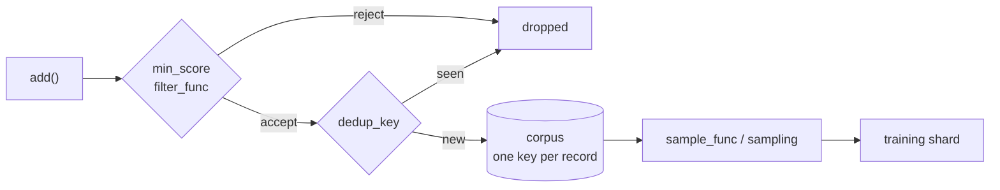

# Data Manager

> Collects scored outputs from the host workflow and builds them into a training
> dataset. Handles organization and synchronization of the data across nodes and
> tasks, so a task anywhere in the workflow can contribute.

API reference: [`rome.data`](../api/rome/data.md)

## Contributing records

The host workflow already produces scored things: completions with rewards,
sequences with pLDDT/pTM/pAE, designs with a simulation score. The data manager
is where those land.

```python
manager.add_training_data(prompt=p, completion=c, score=reward)
manager.add_training_data(sequence=seq, pdb_path=pdb, score=plddt, pTM=ptm, pAE=pae)
```

Everything is keyword-driven, so the same call works for any domain — there is no
schema to satisfy. `prompt`/`completion`/`score` are positional conveniences for
the LLM-shaped case; any other domain just passes keywords. The record is stored
verbatim, plus three stamped fields:

| Field | Meaning |
| --- | --- |
| `uid` | Record identity. Supplied or generated. |
| `added_at` | Wall-clock time, used to order the corpus. |
| `model_version` | The published checkpoint version *at the time the record arrived* — so a later analysis can tell which model produced it. |

The return value is the uid, or `None` when the record was filtered out.

Batches go in with `add_training_batch(records)`, which returns the accepted uids.

!!! info "Callable from anywhere"

    Records are stored **one key per record** in the shared Dragon dictionary, so
    concurrent producers on different nodes never clobber each other. There is no
    read-modify-write anywhere on this path. See
    [Shared state](../design/state.md).

## The corpus is monotonic

Adding is the only thing the host workflow does to the corpus. Filtering,
deduplication and sampling are applied **on the way out**, when a dataset is
built — except for admission checks, which are the one thing applied on the way
in, so a record you never want is never stored at all.



## Admission: `min_score` and `filter_func`

```python
rome.DataConfig(
    min_score=0.5,
    filter_func=lambda r: r["pTM"] > 0.8 and r["pAE"] < 5.0,
)
```

`min_score` compares `record[score_key]` (default `"score"`) and rejects anything
below it, or missing it. `filter_func` is an arbitrary predicate applied after
that; return `False` to drop the record. This is where IMPRESS-R plugs in its
confidence thresholds.

!!! warning "Filters that select nothing"

    `examples.impress_r.mpnn.impress_corpus_filter()` builds IMPRESS's
    pLDDT/pTM/pAE predicate — and its defaults are known to be **too
    permissive**. Measured against a real PDZ campaign they admit 83% of
    records, and `pLDDT >= 80` alone admits 100%, because everything reaching the
    score CSVs has already cleared IMPRESS's own keep/drop rule. The filter is
    being applied downstream of itself.

    Prefer a fraction-based sampler, which needs no absolute scale — see
    [Percentile sampling](#percentile-sampling-when-you-dont-know-your-thresholds)
    below and [`docs/impress.md`](../impress.md).

## Deduplication

```python
rome.DataConfig(dedup_key=lambda r: r["sequence"])
```

`dedup_key` returns a hashable identity; records whose identity was already seen
are dropped. Each process keeps a fast-path set of identities it has seen, but
the authoritative check is a scan of the corpus, so deduplication holds across
nodes.

## Building the shard

`get_training_dataset()` (or `DataManager.get_dataset()`) applies the sampling
policy and returns a list of record dicts — or a `datasets.Dataset` when
`as_hf_dataset=True`, which is what the GRPO trainer asks for via
`TrainTask.wants_hf_dataset`.

### Built-in strategies

```python
rome.DataConfig(sampling="top_k", shard_size=64)
```

| `sampling` | Shard |
| --- | --- |
| `"all"` (default) | The whole corpus, or its last `shard_size` records. |
| `"recent"` | The newest `shard_size` records. |
| `"top_k"` | The best `shard_size` records by `score_key`. |

`shard_size=None` means no limit.

### A custom sampler

`sample_func` takes the whole corpus (oldest first) and returns the shard. It
overrides `sampling` entirely.

```python
def best_half(records):
    ranked = sorted(records, key=lambda r: r["score"], reverse=True)
    return ranked[: len(ranked) // 2]

rome.DataConfig(sample_func=best_half)
```

### Percentile sampling, when you don't know your thresholds

```python
from examples.impress_r.mpnn import percentile_sampler

rome.DataConfig(min_samples=24, sample_func=percentile_sampler(0.33))
```

A threshold like `pTM >= 0.90` is a claim about a *specific* predictor's
confidence scale, and IMPRESS campaigns have been run on both AlphaFold2-multimer
and Boltz, which do not share one. A fraction says "the best third of what this
campaign has produced" — it needs no scale, and it calibrates itself on the fly,
including on the first round, before anyone has seen the distribution.

Ranking is by **average rank across the metrics**, not a weighted sum of raw
values: rank-averaging is non-parametric, so pTM (0–1) and pAE (Å, open-ended)
contribute equally without normalisation, and neither metric's outliers distort
it.

```python
percentile_sampler(
    0.33,
    rank_by={"pTM": "high", "pAE": "low"},
    min_shard=8,          # never return a shard too small to train on
    on_summary=print,     # watch the distribution move, round by round
)
```

`on_summary` receives `{"corpus", "selected", "ranked_by", "percentiles",
"cutoffs"}` each time a shard is built — including the thresholds an equivalent
fixed filter would have used, which is how you eventually learn what your
campaign's real cutoffs are.

## Consumption: what makes a round "possible"

`min_samples` counts **unconsumed** records, not total ones:

```text
unconsumed = total − consumed
ready_to_train() ⇔ unconsumed >= min_samples
```

When a round completes, the training manager calls `mark_consumed()` and the
watermark moves up to the current corpus size. The next round therefore waits for
`min_samples` *new* records rather than firing again immediately on data it has
already trained on.

**The corpus itself is never deleted by this.** Consumption is a watermark, not a
pop. A round still trains on whatever the sampler selects from the *whole*
corpus, which is what makes `sampling="top_k"` meaningful across rounds.

Set `consume_on_train=False` to disable the watermark entirely — every poll then
sees the whole corpus as fresh, so a workflow that wants to retrain on everything
every round can.

## Capping the corpus

```python
rome.DataConfig(max_records=5000)
```

When the corpus exceeds the cap, the oldest records are evicted on the next
`add()`.

!!! danger "On Dragon, leave `max_records` unset unless you have measured that you need it"

    Eviction is the only thing that pops from the corpus dictionary, and a Dragon
    `DDict.keys()` scan **silently returns a truncated list** when another client
    pops concurrently — one measured scan returned 39 of 400 keys and reported
    success. With no evictions the corpus is never popped, so scans are exact and
    the training shard is complete. See [ROME-A on Dragon](../dragon.md).

## Counters

| Property | Meaning |
| --- | --- |
| `total_count` | Records currently in the corpus. |
| `consumed_count` | Records already folded into a completed round. |
| `unconsumed_count` | Records added since the last round consumed. |
| `model_version` | The version currently published by the training manager. |

`len(manager.data)` is `total_count`. `manager.data.get_records()` returns
everything, oldest first, unsampled.

## Configuration reference

```python
rome.DataConfig(
    min_samples=32,          # unconsumed records needed for a round
    max_records=None,        # soft cap; see the Dragon warning above
    score_key="score",       # which field holds the scalar quality
    min_score=None,          # reject below this on the way in
    filter_func=None,        # arbitrary admission predicate
    dedup_key=None,          # record -> hashable identity
    sample_func=None,        # corpus -> shard; overrides `sampling`
    sampling="all",          # 'all' | 'recent' | 'top_k'
    shard_size=None,         # how many the built-in samplers draw
    consume_on_train=True,   # move the watermark when a round completes
    metadata={},             # stamped onto every record (run id, campaign, ...)
)
```

Full field docs: [`rome.data.DataConfig`](../api/rome/data.md#rome.data.DataConfig).
