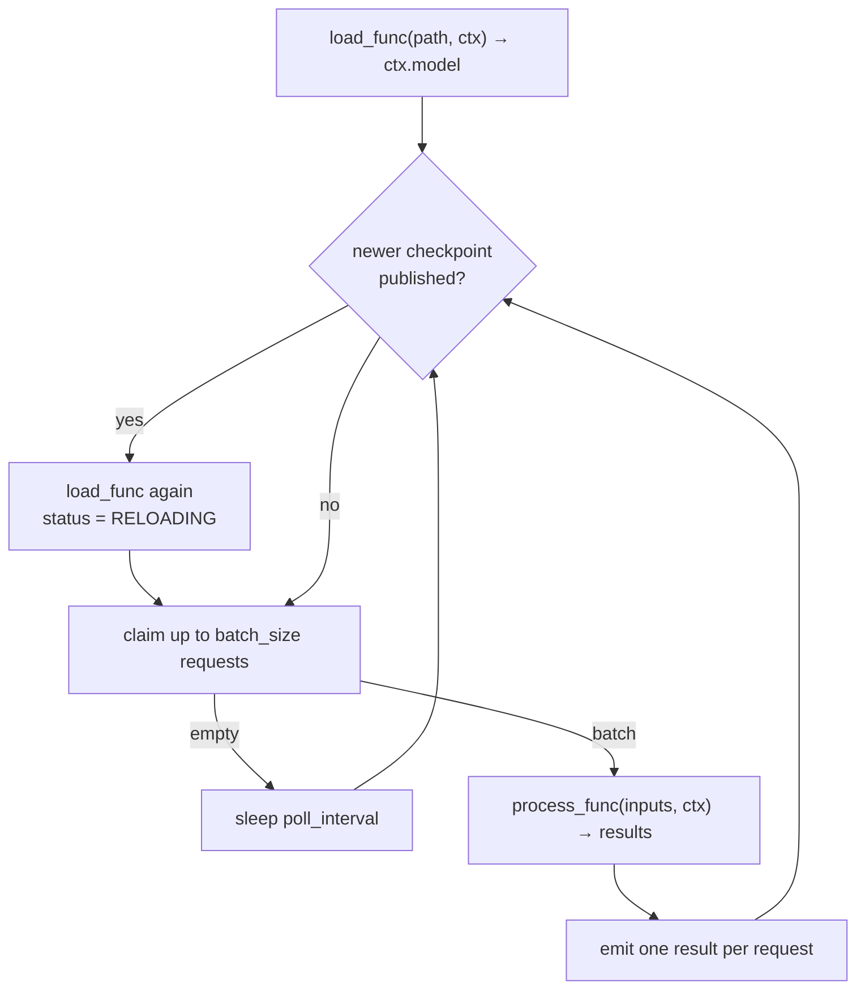

# Stream Manager

> Runs inference and reward as persistent asynchronous tasks using
> workflow-supplied code, and reloads the model when it sees a new checkpoint.

API reference: [`rome.stream`](../api/rome/stream.md)

## Streams are not calls

Inference and reward are not one-shot tasks in ROME. They are long-lived
tasks — submitted to asyncflow as **services** — that sit on their nodes and keep
processing requests for the whole campaign. That is what makes a hot weight swap
possible: there is a running process to swap the weights *in*.

The workflow supplies the actual inference and reward code. ROME supplies the
loop around it.

```python
await manager.stream.start(rome.StreamConfig(
    name="generate",
    kind=rome.StreamKind.INFERENCE,
    load_func=lambda path, ctx: load_my_model(path),
    process_func=lambda prompts, ctx: ctx.model.generate(prompts),
    num_streams=4,
    num_gpus=1,
))
```

Or, equivalently, pass `stream_configs=[...]` to `rome.Manager` and let `start()`
bring them up.

## The managed loop



Two things to notice:

* **Reload happens between batches**, never mid-call. Signalling a reload cannot
  interrupt an in-flight inference.
* **A failure is per-request.** If `process_func` raises, every request in that
  batch gets `{"error": repr(exc)}` and the stream keeps running. One malformed
  payload should not take down a task the rest of the campaign depends on.

## Writing `process_func`

```python
def my_infer(inputs, ctx):
    return [ctx.model.generate(p) for p in inputs]
```

* `inputs` is a list of payloads (up to `batch_size`); `results` must be a list
  of the same length. A bare value is accepted when `batch_size=1`, so an
  existing scalar-returning reward function can be reused unchanged.
* It may be sync or async. A blocking function is pushed to a worker thread, so
  one slow inference call cannot stall the other streams sharing the event loop.
* **The `ctx` argument is optional.** ROME inspects the signature and only
  passes the context when there is somewhere to put it, so existing code shaped
  `f(inputs)` needs no signature change to be adopted.

## Writing `load_func`

```python
def my_load(model_path, ctx):
    return MyModel.from_pretrained(model_path)
```

Called once at startup and again on every reload; its return value becomes
`ctx.model`. Omit it for streams that need no model — most reward functions.

`load_func` must be a **regular function**, not a coroutine: it is called from a
synchronous point in the loop, and an async one raises a clear `TypeError` rather
than silently returning a coroutine as your model.

Extra arguments come from `load_kwargs`:

```python
rome.StreamConfig(load_func=dummy_load, load_kwargs={"latency": 0.05})
```

If no checkpoint has been published when a replica starts, `load_func` never
runs and `ctx.model` is `None`. Handle that — `rome.dummy.dummy_infer` falls back
to an untrained stand-in.

## Submitting and collecting

```python
rid  = manager.submit(payload)                      # one request
rids = manager.stream.submit_batch([p1, p2, p3])    # many

record  = await manager.stream.get_output(rid, timeout=30.0)   # one, by id
records = manager.get_outputs()                                # everything ready
```

Requests round-robin across a group's replicas, so every task gets an even share
without needing a shared claim protocol. Each replica then **pops** the requests
it claims, and popping is what makes a request owned: a key is removed by exactly
one claimer, so two replicas never double-process a request. (Four threads racing
over 120 keys claim 120 with zero duplicates — see [Shared state](../design/state.md#pop-is-an-exactly-once-claim).)

`get_outputs()` drains by default. Pass `consume=False` to peek without draining,
which is what a progress display wants. `get_output(rid)` returns `None` on
timeout rather than raising, so a caller polling several requests can keep going.

An output record looks like:

```python
{
  "request_id": "a1b2...",
  "result": <whatever process_func returned for it>,
  "stream": "generate",
  "stream_index": 2,
  "kind": "inference",
  "model_version": 3,          # the version *this replica* was serving
  "completed_at": 1724978401.2,
}
```

## Several groups at once

Start one group per role and route by name:

```python
stream_configs=[
    rome.StreamConfig(name="generate", kind=rome.StreamKind.INFERENCE, ...),
    rome.StreamConfig(name="score",    kind=rome.StreamKind.REWARD, ...),
]

manager.submit(prompt, stream="generate")
manager.get_outputs(stream="score")
```

With exactly one group started, `stream=` may be omitted. With several, omitting
it raises rather than guessing.

## Reward streams feed the corpus

`StreamKind.REWARD` is not just a label. A reward stream's whole point is to
score things for training, so unless you set `on_output` yourself, `rome.Manager`
wires its results straight into the data manager:

* a `process_func` returning a **dict** becomes a corpus record;
* a `process_func` returning a **number** becomes a record with that score;
* anything else is left alone — ROME does not guess at a shape it does not
  recognise.

```python
def my_reward(outputs, ctx):
    return [{"completion": o, "score": score_it(o)} for o in outputs]
```

To intercept instead, set `on_output` and do your own thing with each record as
it is produced.

## Reloading weights

Usually you never call this: `rome.Manager` wires the training manager's
checkpoint callback to `Stream.on_checkpoint`, so publishing a checkpoint and
hot-swapping the streams are the same event.

To drive it by hand:

```python
await manager.reload_model()                          # reload what's published
await manager.reload_model("/path/to/ckpt")           # publish + reload
manager.stream.signal_reload(stream="generate")       # flag it, don't wait
```

`reload_model(wait_for_reload=True)` returns once every targeted replica has the
new weights **in memory** — the reload flag is cleared last, after `load_func`
returns, so a waiter never unblocks early.

With `auto_reload=True` (the default) a replica also watches the published
version between batches and reloads without being asked. Turn it off to reload
only on an explicit call.

## Status and shutdown

```python
manager.get_stream_status()                # [StreamStatus.RUNNING, ...]
manager.stream.report()                    # per-group summary
manager.stream.pending()                   # queued, unclaimed requests
```

A replica's status lives in the shared dictionary rather than on the object, so a
manager on another node can read it: `NOT_STARTED`, `STARTING`, `RUNNING`,
`RELOADING`, `STOPPING`, `STOPPED`, `FAILED`.

`report()` reports the **published** model version, read from shared state, not a
replica's local one: a replica's `local_version` lives in its task process and
never comes back to the driver, so reading that would report 0 on a multi-process
backend even while the replica is happily serving the latest checkpoint.

Shutdown is two steps on purpose:

```python
await manager.stream.stop()      # signal, drain, wait
records = manager.get_outputs()  # collect what draining produced
manager.stream.close()           # release the group dictionaries
```

`stop()` does not release the group dictionaries, so results drained on the way
down stay readable — which is the whole point of `drain_on_stop`. `Manager.stop()`
does both in the right order for you.

## Resources and placement

```python
rome.StreamConfig(num_streams=4, num_gpus=1, num_nodes=1)
rome.StreamConfig(task_description={"ranks": 2, "gpus_per_rank": 4})  # verbatim
```

!!! warning "A stream holds an execution slot for the whole run"

    A service task never returns, so `num_streams` replicas permanently occupy
    `num_streams` of the allocation's concurrent-task slots. Leave room for the
    training round, or it will be accepted and never placed. On a small node the
    capacity is ~2; measure yours with `tests/dragon/test_task_capacity_dragon.py`.

    This interacts with result delivery too — see
    [Execution](../design/execution.md#when-the-backend-never-delivers-a-result).

## Owning the loop yourself

`stream_func` replaces the managed loop entirely, and gets the same context:

```python
def my_loop(ctx):
    while not ctx.should_stop():
        ctx.maybe_reload()
        for request_id, payload in ctx.next_requests(limit=8):
            ctx.emit(request_id, my_work(payload, ctx.model))
```

The implementation must honour `ctx.should_stop()` and call `ctx.maybe_reload()`
between batches. `process_func` is ignored when `stream_func` is set.

[`StreamContext`](../api/rome/stream.md#rome.stream.StreamContext) also exposes
`ctx.model`, `ctx.model_path`, `ctx.model_version`, `ctx.index` (which replica
this is), `ctx.ddict` (ROME's shared state) and `ctx.stream_ddict` (this
group's own).

## Configuration reference

```python
rome.StreamConfig(
    name="default",
    kind=rome.StreamKind.INFERENCE,   # or REWARD
    process_func=None,                # (inputs, ctx) -> results
    load_func=None,                   # (model_path, ctx) -> model
    stream_func=None,                 # (ctx) -> None; full override
    model_path=None,                  # initial checkpoint
    num_streams=1,
    num_gpus=1,
    num_nodes=1,
    task_description=None,            # overrides num_gpus/num_nodes
    as_service=True,
    batch_size=1,
    poll_interval=0.1,                # idle sleep when the queue is empty
    auto_reload=True,
    drain_on_stop=True,
    on_output=None,                   # called with each output record
    load_kwargs={},
    ddict=None,                       # supply this group's dictionary
    ddict_kwargs=None,
)
```

Full field docs: [`rome.stream.StreamConfig`](../api/rome/stream.md#rome.stream.StreamConfig).
