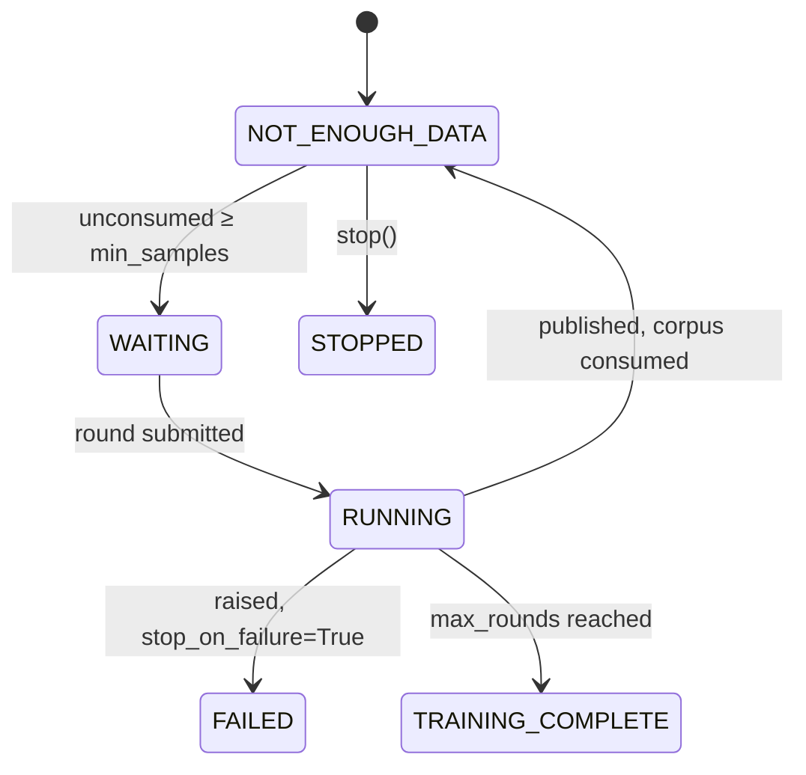

# Training Manager

> Creates and schedules training tasks on HPC, publishes updated checkpoints back
> to the workflow, and reports whether training is possible, running or finished.

API reference: [`rome.trainer`](../api/rome/trainer.md)

## What it owns

Three responsibilities, and nothing else:

1. **Schedule rounds.** Every round is submitted to the `radical.asyncflow`
   engine the host workflow handed over, so a training task gets its own nodes
   and GPUs like any other workflow task. ROME-A schedules nothing itself.
2. **Publish checkpoints.** A finished round writes a checkpoint, and the manager
   makes it visible to the rest of the run — the streams reload from it, the host
   workflow reads it back with `get_current_model()`.
3. **Answer the status question.** Is training *possible*, *running*, or
   *finished*?

Deciding *what* training means is not on that list. That belongs to a
[`TrainTask`](trainers.md).

## Configuring it

```python
rome.TrainerConfig(
    trainer=MyTrainer(gpus=4, nodes=2),
    checkpoint_dir="/scratch/$USER/rome_checkpoints",
    auto_train=True,
    max_rounds=None,
    poll_interval=5.0,
    result_fallback_seconds=60.0,
    task_description=None,
    train_kwargs={},
    on_checkpoint=None,
    stop_on_failure=False,
)
```

`trainer` is the only required field. A bare callable
`(dataset, output_dir, **kwargs) -> checkpoint_path` is wrapped in a
[`FunctionTrainer`](../api/rome/train/base.md#rome.train.base.FunctionTrainer)
automatically, so an existing training script plugs in with no subclassing.

## Automatic rounds

With `auto_train=True` (the default), `start()` spawns a poll loop that fires a
round whenever the corpus crosses `min_samples`:



The poll loop is a plain asyncio task in the manager's own process. Only the
training rounds themselves go to the execution backend.

## Manual rounds

```python
trainer_config=rome.TrainerConfig(trainer=my_trainer, auto_train=False)
...
checkpoint = await manager.start_training()          # force=True by default
checkpoint = await manager.start_training(force=False)   # respect min_samples
```

`start_training(force=False)` returns `None` when the corpus is not ready, or
when another round is already in flight — a round never overlaps another.

Failures **propagate** from a manual call. That is deliberate: a manual trigger
is expected to surface its own errors, unlike the auto-train loop, which records
them and keeps polling.

## Status

```python
manager.get_training_status()      # -> TrainerStatus
```

| Status | Meaning |
| --- | --- |
| `NOT_STARTED` / `STARTING` | Before `start()` has settled. |
| `NOT_ENOUGH_DATA` | Idle: a round is **not currently possible**. |
| `WAITING` | Idle: a round **is possible** and about to start. |
| `RUNNING` | A round is in flight. |
| `TRAINING_COMPLETE` | `max_rounds` reached. |
| `STOPPING` / `STOPPED` | Shutting down, or down. |
| `FAILED` | A round raised with `stop_on_failure=True`. |

`NOT_ENOUGH_DATA` and `WAITING` are both idle, but they answer different
questions, which is why they are separate members rather than one `IDLE`.
`status.is_idle` and `status.is_terminal` group them.

The traceback of the most recent failed round is on `manager.trainer.last_error`,
and in `report()["training"]["last_error"]`.

## What publishing does

When a round returns, the manager, in this order:

1. writes the checkpoint path to shared state,
2. bumps the model version,
3. records `last_trained_at` and `last_train_samples`,
4. marks the corpus consumed,
5. fires every checkpoint callback.

**The order of 1 and 2 matters.** A stream task polls the *version* to decide
whether to reload; writing the path first means a stream that notices the new
version always finds a valid path behind it.

Checkpoints land in `<checkpoint_dir>/<trainer name>/v<version>`.

## The callback that closes the loop

```python
manager.trainer.on_checkpoint(lambda path, version: print(f"v{version} -> {path}"))
```

`rome.Manager.start()` registers exactly one of these by default, and it is the
whole of ROME's closed loop:

```python
self.trainer.on_checkpoint(self.stream.on_checkpoint)
```

A completed training round *is* the event that swaps inference onto the new
model. Pass `auto_reload_streams=False` to `Manager` if the workflow would rather
decide when inference switches models.

A callback that raises is caught and printed, never allowed to lose a checkpoint.

## Failure handling

```python
rome.TrainerConfig(stop_on_failure=True)
```

By default a failed round is recorded in `last_error`, the status returns to
idle, and the poll loop keeps going — a transient failure should not end a
campaign. With `stop_on_failure=True` the manager moves to `FAILED` and the loop
ends.

An unusable corpus fails *before* a task is scheduled:
`TrainTask.validate(dataset)` runs on the manager, so an empty or malformed
dataset raises there instead of burning an HPC allocation.

## Stopping

```python
await manager.stop(wait=True, timeout=300.0)
```

An in-flight round is **not cancelled** — killing a half-finished fine-tune would
leave a torn checkpoint — so `stop()` waits it out. The streams are stopped
*after* the trainer, so they are still serving while the last round finishes and
still receive its checkpoint.

## Resources for a round

The manager derives an asyncflow `task_description` from the `TrainTask`'s own
`gpus` and `nodes`, which is what keeps "adding a training algorithm is one task"
true — the algorithm declares what it needs, and nothing else has to be
configured.

```python
rome.TrainerConfig(trainer=MyTrainer(gpus=4, nodes=2))
```

Override it wholesale for a backend whose keys ROME-A does not know:

```python
rome.TrainerConfig(
    trainer=MyTrainer(),
    task_description={"ranks": 2, "gpus_per_rank": 4, "pre_exec": ["module load cuda"]},
)
```

ROME-A does not interpret a `task_description`; it is passed straight through.

## When a round runs as a command

A `TrainTask` that implements `as_command()` is submitted as an **executable**
task — a shell command running the round in its own process — rather than a
function task. A GPU fine-tune should prefer this: the subprocess exits when the
round ends, releasing its VRAM with it.

That path has one extra contract, and one extra config knob:

* the command must write a `train_complete` marker into its output directory as
  its final action, and
* `result_fallback_seconds` bounds how long the manager waits on the execution
  backend before believing the disk instead.

Both exist because of a real Dragon defect where a finished task's result is
never delivered. [Execution](../design/execution.md#when-the-backend-never-delivers-a-result)
explains it; [Writing a trainer](trainers.md#running-a-round-as-a-command) shows
the implementation side.

## Passing arguments into a round

```python
rome.TrainerConfig(trainer=my_trainer, train_kwargs={"epochs": 5})
await manager.start_training(epochs=8)      # per-call, wins over train_kwargs
```

Both are forwarded to `TrainTask.train`. ROME-A also adds `model_version` for the
round being run, so a trainer can name its checkpoint after it.
