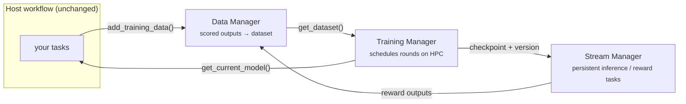

# ROME

**RADICAL Optimizer for Model Enhancement** — self-improving models as a
component you add to a workflow you already have.

---

## The problem ROME-A solves

The original ROME exposed self-improvement as a *workflow* with three
components — model inference, reward/simulation, and model training. Building a
new improvement workflow with ROME was easy. Plugging ROME into a workflow you
already had was not: you adopted ROME's control flow, or you did not adopt ROME.

**ROME-A** inverts that. Model improvement becomes a set of pluggable modules
you attach to an existing workflow rather than a workflow you adopt:

* each component is a configurable unit,
* adding a new model or training algorithm is a single task,
* adoption costs a handful of API calls — the host workflow's own code does not
  move.

An [IMPRESS](impress.md) protein-design campaign adopts ROME-A by adding two
lines inside its adaptive step. The campaign keeps running exactly as it did;
mid-campaign, the model it designs with starts getting better.

## The three managers

| Component | What it does | API |
| --- | --- | --- |
| **[Data Manager](guide/data.md)** (`rome.data`) | Collects scored outputs from the host workflow and builds them into a training dataset. Handles organization and synchronization of the data across nodes and tasks, so a task anywhere in the workflow can contribute. | `add_training_data`, `get_training_dataset` |
| **[Stream Manager](guide/streams.md)** (`rome.stream`) | Runs inference and reward as persistent asynchronous tasks using workflow-supplied code, and reloads the model when it sees a new checkpoint. | `submit`, `get_outputs`, `reload_model` |
| **[Training Manager](guide/training.md)** (`rome.trainer`) | Creates and schedules training tasks on HPC, publishes updated checkpoints back to the workflow, and reports whether training is possible, running or finished. | `start_training`, `get_training_status`, `get_current_model` |

[`rome.Manager`](api/rome/manager.md) wires the three together. The line that
closes the loop is the training manager's checkpoint callback being the stream
manager's reload hook: **a completed training round *is* the event that swaps
inference onto the new model.** Nothing in the host workflow has to orchestrate
that.



## Adoption in one screen

```python
import rome
from examples.impress_r.mpnn import ProteinMPNNConfig, ProteinMPNNTrainer, percentile_sampler

manager = rome.Manager(
    asyncflow,                                  # your existing WorkflowEngine
    data_config=rome.DataConfig(
        min_samples=24,
        sample_func=percentile_sampler(0.33),   # train on the campaign's best third
    ),
    trainer_config=rome.TrainerConfig(
        trainer=ProteinMPNNTrainer(ProteinMPNNConfig(
            mpnn_repo="/path/to/dauparas/ProteinMPNN",   # the repo IMPRESS runs
            publish_into_repo=True,                      # so the next pass runs it
        )),
    ),
)
await manager.start()

# ... your workflow runs unchanged ...
manager.add_training_data(sequence=seq, pdb_path=pdb, score=plddt)
weights = manager.get_current_model()           # None until the first round

await manager.stop()
```

Training starts automatically once `min_samples` fresh records accumulate, or on
demand via `await manager.start_training()`.

## Where to go next

<div class="grid cards" markdown>

- :material-download: **[Installation](installation.md)** — install ROME-A, its
  extras, and the Dragon runtime it keeps shared state in.

- :material-rocket-launch: **[Quickstart](quickstart.md)** — run the closed loop
  end to end in under a minute, with no model and no GPU.

- :material-puzzle: **[Adopting ROME-A](guide/adoption.md)** — the four calls
  that attach model improvement to a workflow you already have.

- :material-sitemap: **[Design](design/architecture.md)** — why three managers,
  what each one owns, and how state crosses nodes.

- :material-api: **[API reference](api/rome/manager.md)** — every public class,
  generated from the source.

- :material-server: **[Running on a cluster](delta.md)** — end-to-end setup on
  Delta, a smoke-test ladder, and a Slurm script.

</div>

## Trying it without a model

`rome.dummy` ships a trainer that sleeps instead of fine-tuning and an inference
stream that emits `model example output [<uuid>]`. Everything else in the run is
real — tasks are placed by the workflow engine, state crosses the DDict, and the
checkpoint is a file that is genuinely written and read back — so it is the right
first thing to run on a new backend or allocation:

```bash
dragon examples/agnostic/dummy_loop.py
```

```text
  v0 | model example output [7af1236d-dad6-4300-a8c3-a00d53a4ca65]
round 0: corpus   4 (4 fresh) | model v0 | WAITING
  ...
  v3 | model example output [76ad7d76-0aef-4de1-a0fd-de6ba02390ad]
round 6: corpus  28 (4 fresh) | model v3 | WAITING
```

The version climbs while the stream keeps serving; it is never restarted.

## Project layout

```text
rome/            ROME-A
  manager.py       Manager — wires the three components together
  data.py          Data Manager
  stream.py        Stream Manager
  trainer.py       Training Manager
  train/           trainer tasks (base, llm/GRPO)
  utils.py         DDict layout helpers + asyncflow submission
  dummy.py         model-free trainer and streams, for smoke tests
oldrome/         the original ROME flows, kept for reference
examples/        ROME-A adoption examples
protein_generation/  IMPRESS pipeline scripts
```
